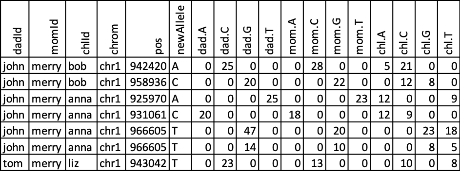

.. _examples:

*******************
Additional Examples
*******************

Paper Example
=============

This section explains how to load and execute the small project described in the
``snakeobjects`` paper. We assume that you will work or a Linux or Mac. In
addition, we assume that you have conda or miniconda installed (`Conda
Installation
<https://docs.conda.io/projects/conda/en/latest/user-guide/install>`_).
Everything else needed is included in the
:download:`snakeobjectsPaperExample.tgz <./snakeobjectsPaperExample.tgz>`. When
you download and extract (``tar xzf snakeobjectsPaperExample.tgz``) file, you
will get a directory called ``snakeobjectsPaperExample``. We assume here that
this directory is placed in /tmp, but you can place it elsewhere.
Next execute the following commands:

.. code-block:: bash
		
	(base) .............................$ cd /tmp/snakeobjectsPaperExample
	(base) /tmp/snakeobjectsPaperExample$ conda env create
	(base) /tmp/snakeobjectsPaperExample$ conda activate snakeobjectsPaperExample
	(snakeobjectsPaperExample) /tmp/snakeobjectsPaperExample$ sobjects describe
	# WORKING ON PROJECT /private/tmp/snakeobjectsPaperExample
	# WITH PIPELINE /private/tmp/snakeobjectsPaperExample
	Project parameters:
		inputDir: /private/tmp/snakeobjectsPaperExample/input
		chrAllFile: /private/tmp/snakeobjectsPaperExample/input/chrAll.fa
		pedigree: /private/tmp/snakeobjectsPaperExample/input/collection.ped
		fastqDir: /private/tmp/snakeobjectsPaperExample/input/fastq
		target: /private/tmp/snakeobjectsPaperExample/input/targetRegions.txt
	Object types:
        (snakeobjectsPaperExample) /tmp/snakeobjectsPaperExample$ sobjects prepare
	# WORKING ON PROJECT /private/tmp/snakeobjectsPaperExample
	# WITH PIPELINE /private/tmp/snakeobjectsPaperExample
        (snakeobjectsPaperExample) /tmp/snakeobjectsPaperExample$ sobjects run -j -q
	# WORKING ON PROJECT /private/tmp/snakeobjectsPaperExample
	# WITH PIPELINE /private/tmp/snakeobjectsPaperExample
	UPDATING ENVIRONMENT:
	export SO_PROJECT=/private/tmp/snakeobjectsPaperExample
	export SO_PIPELINE=/private/tmp/snakeobjectsPaperExample
	export PATH=$SO_PIPELINE:$PATH
	RUNNING: snakemake -s /private/tmp/snakeobjectsPaperExample/objects/.snakeobjects/main.snakefile -d /private/tmp/snakeobjectsPaperExample/objects -j -q
	Job counts:
		count	jobs
		6	align
		3	callDenovos
		1	gatherDenovos
		6	indexBam
		1	makeBwaIndex
		6	reorganizedBam
		1	so_all_targets
		1	so_denovo_obj
		6	so_individual_obj
		1	so_reference_obj
		3	so_trio_obj
		35

In the subdirectory objects/denovo/o you will find the allDenovoCalls.txt file.
Opening it in excel with a little formatting will get:

Snakemake Tutorial Example
==========================

This section explains how to load and execute the small project reimplementing
in snakeobject
`snakemake Tutorial example <https://snakemake.readthedocs.io/en/stable/tutorial/tutorial.html>`_.
We assume that you will work or a Linux or Mac. In addition, we assume that you
have conda or miniconda installed (`Conda
Installation
<https://docs.conda.io/projects/conda/en/latest/user-guide/install>`_).
Everything else needed is inclucded in the
:download:`snakemakeTutorialExample.tgz <./snakemakeTutorialExample.tgz>`.
When you download and extract (``tar xzf snakemakeTutorialExample.tgz``) file,
you will get a directory called ``snakeomakeTutorialExample``. We assume here
that this directory is placed in /tmp, but you can place it elsewhere.
You can then follow the same steps as described in the ``Paper example`` above.

Tests Demo Examples
===================

There are nine mini projects in the directory ``snakeobjects/tests/demos``.
Each mini project describes some features of snakeobjects.
