.. _tutorial:

********
Tutorial
********

Introduction
============

In this tutorial we will gradually build a complex example that closely mimics
a realistic scenario using simulated data. We will pretend to be a
bioinformatician involved in a large :term:`project` for examining *de novo* mutations
in a set of children. We were just given a directory  containing the first
batch of exome sequence data generated from 100 families comprised of mother,
father, and a child and we were asked to examine the quality of the data and to
identify *de novo* substitutions in the 100 children. A *de novo*
substitution is a nucleotide at a given position in a child that is not present
in his/her parents at that position.

Setup
=====

``snakeobjects`` and this tutorial are tested and work well on Linux; they
don't work on Windows. We assume that you will work on a Linux or Mac. In
addition, we assume that you have conda or miniconda installed (`Conda
Installation
<https://docs.conda.io/projects/conda/en/latest/user-guide/install>`_).
Everything else needed to follow this tutorial is included in the
:download:`snakeobjectsTutorial.tgz <./snakeobjectsTutorial.tgz>`. When you
download and extract (``tar xzf snakeobjectsTutorial.tgz``) the file, you will
get a directory called ``snakeobjectsTutorial``. In the examples that follow we
have assumed that the ``snakeobjectsTutorial`` directory is created in the
``/tmp`` directory, but this is not essential. Everything will work just fine
if you have the ``snakeobjectsTutorial`` in your home directory or anywhere
else.

The ``snakeobjectsTutorial`` folder contains one file named ``environment.yml``
and two subdirectories: ``input``, and ``solutions``.

The ``environment.yml`` file defines the conda environment we will use
throughout the tutorial:

.. literalinclude:: snakeobjectsTutorial/environment.yml

To create the ``snakeobjectsTutorial`` environment and to activate it we can use
the following commands:

.. code-block:: bash

    (base) .........................$ cd /tmp/snakeobjectsTutorial
    (base) /tmp/snakeobjectsTutorial$ conda env create
    (base) /tmp/snakeobjectsTutorial$ conda activate snakeobjectsTutorial
    (snakeobjectsTutorial) /tmp/snakeobjectsTutorial$

The command line prompt shows the activated conda environment and the current
working directory. We will show this long prompt everywhere below to remind
you that you must work under the ``snakeobjectsTutorial`` environment and
because a lot of the commands depend on the current working directory.

The ``input`` directory contains the input data for our project.
Inside it you will find a short ``README.txt`` file describing the contents.
Briefly, the directory contains the reference genome (``chrAll.fa``), the known
genes (``genes.txt``), and the regions targeted by the exome capture
(``targetRegions.txt``).  For the purposes of the tutorial we will use only the
first 1MB of human chromosome 1 that contains 54 transcripts from 36
different genes. The genes include 67 protein coding regions/exons that are
targeted by the hypothetical exome capture.
There are also 768 fastq files in the sub-directories of ``input/fastq`` grouped
into 384 pairs of read 1---read 2 files (i.e.,
``fastq/FC0A03F0C/L007/bcL_R1.fastq.gz`` and
``fastq/FC0A03F0C/L007/bcL_R2.fastq.gz``. This is a typical structure of the
output for the so-called paired-end sequencing. In addition, there is a file
called ``fastqs.txt`` providing the additional information for each of the
fastq files (i.e., the individuals for each of the fastq files) and the
``collection.ped`` file describing the 100 trio families using a standard
pedigree file that has one line for each of the 300 individuals.

Finally, the ``solutions`` subdirectory contains the state of the :term:`pipeline` and
the projects at various stages (steps) of the tutorial. For example,
``solutions/step-2.4`` contains the state after we have completed Step 2.4. For
the impatient, the ``solutions/final`` contains the complete pipeline built by
the end of the tutorial.

Step 1. Examining the fastq files
=================================

We will build a pipeline for achieving our goals or identifying the *de novo*
variants and the judging the quality of the data by small steps. We will start
with a simple pipeline that counts the number of pairs of reads for each fastq run.

Step 1.1. Create project and pipeline directories
-------------------------------------------------

First, let's create a directory called ``pipeline`` where we will add the
pipeline's components and a directory called ``project`` where we will store the
results of the pipeline. We will assume that you create these directories in
the ``snakeobjectsTutorial`` directory:

.. code-block:: bash

    (snakeobjectsTutorial) /tmp/snakeobjectsTutorial$ mkdir pipeline
    (snakeobjectsTutorial) /tmp/snakeobjectsTutorial$ mkdir project

This location of the directories is not required. Provided you are willing
to make few minor changes in the projects' configuration you can create
the two directories anywhere.

Step 1.2. Configure the project
-------------------------------

Next, we will create a file called :term:`so_project.yaml` in the ``project``
directory with the following content:

.. literalinclude:: snakeobjectsTutorial/solutions/step-1.5/project/so_project.yaml

This ``so_project.yaml`` configures our first snakeobjects project. The first
line specifies that the pipeline that will operate on this project is contained
in the directory ``../pipeline`` relative to the project directory. The
``[P:projectDir]`` is an example for *interpolation* feature available in the
project configuration files. Alternatively, we could
have specified the pipeline directory using a full path
(``/tmp/snakeobjectsTutorial/pipeline``). The second line adds a configuration
property called ``inputDir`` that points to the input directory that was given
to us. Here we have also used a path relative to the project directory, which
is convenient for the purposes of the tutorial. The ``inputDir`` parameter will not
be used by the pipeline directly. We will only use it in the ``so_project.yaml`` file
to define the values of other :term:`project parameters` relative to the `inputDir`.
Indeed, the next two
properties  ``fastqsFile`` and ``fastqDir`` are defined succinctly based on the
``inputDir`` and point to the table describing the fastq files and to the
directory containing the fastq files. Using ``inputDir`` is optional --- we
could have defined the fastqDir as ``"[P:projectDir]/../input/fastq"`` or with a
full path to the directory, ``/tmp/snakeobjectsTutorial/input/fastq``.

To check if the configuration was successful, we can use the :option:`sobjects
describe` command from within the project directory (the easiest way to tell
``sobjects`` which project it should operate on is to 'go into' the project's
directory or any of its subdirectories):

.. code-block:: bash

    (snakeobjectsTutorial) /tmp/snakeobjectsTutorial$ $ cd project
    (snakeobjectsTutorial) /tmp/snakeobjectsTutorial/project$ sobjects describe
    # WORKING ON PROJECT /tmp/snakeobjectsTutorial/project
    # WITH PIPELINE /tmp/snakeobjectsTutorial/pipeline
    Project parameters:
        so_pipeline: /tmp/snakeobjectsTutorial/project/../pipeline
        inputDir: /tmp/snakeobjectsTutorial/project/../input
        fastqDir: /tmp/snakeobjectsTutorial/project/../input/fastq
        fastqsFile: /tmp/snakeobjectsTutorial/project/../input/fastqs.txt
    Object types:

The result should show that sobjects has determined the project and the pipeline
directories and that the ``fastqDir`` and ``fastqsFile`` project properties
point to the correct locations:

.. code-block:: bash

    ....$ head /tmp/snakeobjectsTutorial/project/../input/fastqs.txt
    flowcell	lane	barcode	individual
    FC0A03F09	L006	D	SM90370
    FC0B03F03	L001	D	SM90370
    FC0A03F09	L006	E	SM03231
    FC0B03F03	L001	E	SM03231
    FC0A03F09	L006	F	SM79279
    FC0B03F03	L001	F	SM79279
    FC0A03F0C	L007	D	SM14701
    FC0B03F00	L008	D	SM14701
    FC0C03F00	L004	D	SM14701

Step 1.3. Create the build_object_graph.py
------------------------------------------

Now that have configured our first project, we will turn our attention to the
pipeline. So far the pipeline directory is empty. The first thing to do when
starting a pipeline is to create the :term:`build_object_graph.py` script. In the
**Step 1** we will create a very simple graph that contains one object for each
fastq pairs of files. The fastq pairs are listed in the fastqs.txt file in the input
directory and we have already ensured that our project has a parameter
(``fastqsFile``) that points to the fastqs.txt. The contents of our first
``build_object_graph.py`` are shown below. You should create a file named
``build_object_graph.py`` in the pipeline directory and copy the shown contents
in the file.

.. literalinclude:: snakeobjectsTutorial/solutions/step-1.5/pipeline/build_object_graph.py

The ``run`` function is given the project (``proj``) for which it will create a
new object graph and :term:`object graph` instance (``OG``) that it should add the new
objects into. In the first two lines, the function accesses the necessary
parameters through ``proj.parameters``: the ``fastqDir`` pointing to the
directory with the fastq files and the ``fastqsFile`` pointing to the table
describing the project fastq pairs of files (or fastq runs).  The function,
then uses pandas to read and iterate over all lines of this table and for each
line adds (:py:meth:`snakeobjects.ObjectGraph.add`) an object of type ``fastq``
and object id equal to the ``flowcell``, ``lane``, and ``'barcode`` properties
concatenated with ``.``. For example, the object created for the first line of
the fastqs.txt file will have an object id equal to ``FC0A03F0F.L004.J``. Three
parameters are also added to each of objects: ``R1`` and ``R2`` point to the
fastq files for the first and for the second reads defined relative to the
project's ``fastqDir`` parameter, and the ``sampleId`` is assigned the value of
the ``individual`` column.

Step 1.4. Prepare the project
-----------------------------

Next we will create the object graph for our project. We do that by using the
:option:`sobjects prepare` command from within the project directory. We can
then follow with the :option:`sobjects describe` to see description of the
created object graph:

.. code-block:: bash

    (snakeobjectsTutorial) /tmp/snakeobjectsTutorial/project$ sobjects prepare
    # WORKING ON PROJECT /tmp/snakeobjectsTutorial/project
    # WITH PIPELINE /tmp/snakeobjectsTutorial/pipeline
    (snakeobjectsTutorial) /tmp/snakeobjectsTutorial/project$ sobjects describe
    # WORKING ON PROJECT /tmp/snakeobjectsTutorial/project
    # WITH PIPELINE /tmp/snakeobjectsTutorial/pipeline
    Project parameters:
        so_pipeline: /tmp/snakeobjectsTutorial/project/../pipeline
        inputDir: /tmp/snakeobjectsTutorial/project/../input
        fastqDir: /tmp/snakeobjectsTutorial/project/../input/fastq
        fastqsFile: /tmp/snakeobjectsTutorial/project/../input/fastqs.txt
    Object types:
         fastq : 384

The above says that we have created an object graph that has 384 objects of
type ``fastq``, that is exactly what we expected.

Importantly, the :option:`sobjects prepare` command created a directory
``objects`` in the project directory. The ``objects`` directory contains large number of
subdirectories and two files:

.. code-block:: bash

    (snakeobjectsTutorial) /tmp/snakeobjectsTutorial/project$ find objects | head
    objects
    objects/.snakeobjects
    objects/.snakeobjects/OG.json
    objects/.snakeobjects/main.snakefile
    objects/fastq
    objects/fastq/FC0A03F09.L006.G
    objects/fastq/FC0A03F09.L006.G/log
    objects/fastq/FC0A03F0F.L007.E
    objects/fastq/FC0A03F0F.L007.E/log
    objects/fastq/FC0A03F06.L008.I

The :term:`objects/.snakeobjects/OG.json` file stores the object graph that was
just created and the :term:`objects/.snakeobjects/main.snakefile` is the projects
specific snakefile that will be provided to the snakemake upon execution of the
pipeline. In addition, there are directories for each object from the objects
graph where the objects' targets will be stored: the
``objects/fastq/FC0A03F09.L006.G`` directory will contain the targets for the
object of type ``fastq`` and object id ``FC0A03F09.L006.G``. Each of the object
directories has also a log subdirectory (i.e.,
``objects/fastq/FC0A03F09.L006.G/log``) where log files associated with the
object will be stored (more about log files later).

In addition, the :option:`sobjects prepare` created one file,
``fastq.snakefile``, in pipeline directory. This is not a typical behavior: as
a rule, **sobjects** only updates the project directory (and to be more
specific, only its ``objects`` subdirectory), but when we start a new pipeline
it's handy to have placeholders for the :term:`object type` snakemake files be created
for us. The content if the new ``fastq.snakefile`` is very simple:

.. literalinclude:: snakeobjectsTutorial/solutions/step-1.5/pipeline/fastq.snakefile

This simple one line accomplishes nothing but reminding us that the next step would
be to declare the targets to be created for objects of  type ``fastq``. There
is one special target automatically added to every object file, and it is
called ``T("obj.flag")``. It is created after all the other targets for the
object are successfully created. Without explicitly adding object type targets
(as in the current state of the ``fastq.snakefile``), the ``T("obj.flag")`` is
the only target. We will keep this situation for now, and add useful targets
shortly.

Step 1.5. Execute the dummy project
-----------------------------------

After we have *prepared* the project, it is time to execute it. This is done by
:option:`sobjects run` command. This command requires at least one argument to
that we use to control how to execute the pipeline:  ``-j`` means that we can
use all the available local cores to execute the pipeline; ``-j 1`` means that
we can use only one of the local cores; ``-j 2`` means that we can use 2 local
cores, etc. Alternatively, we can add ``--profile <cluster profile>`` option
which indicate that we will execute the pipeline by submitting jobs to the
computation cluster defined by the ``<cluster profile>``.  Executing pipelines
on cluster will be covered later. For now, we would use the simplest ``-j`` form
to execute the *dummy* pipeline we have developed so far. We can specify more
options to the :option:`sobjects run` command that control the execution of the
pipeline and here we would use the ``-q`` command that instructs the underlying
``snakemake`` to be 'quiet' and produce only minimal output:

.. code-block:: bash

    (snakeobjectsTutorial) /tmp/snakeobjectsTutorial/project$ sobjects run -j -q
    # WORKING ON PROJECT /tmp/snakeobjectsTutorial/project
    # WITH PIPELINE /tmp/snakeobjectsTutorial/pipeline
    UPDATING ENVIRONMENT:
    export SO_PROJECT=/tmp/snakeobjectsTutorial/project
    export SO_PIPELINE=/tmp/snakeobjectsTutorial/pipeline
    export PATH=$SO_PIPELINE:$PATH
    RUNNING: snakemake -s /tmp/snakeobjectsTutorial/project/objects/.snakeobjects/main.snakefile -d /tmp/snakeobjectsTutorial/project/objects -j -q
    Job counts:
        count	jobs
        1	so_all_targets
        384	so_fastq_obj
        385

As usual, the first two lines show the project and the pipeline that
``sobjects`` operates with. The next five lines provide information about how
``sobjects`` executes ``snakemake``, including the environment variables and
the command line parameters passed to ``snakemake``. Finally, we see the number
of successfully executed jobs summarized  by the ``snakemake`` rules used for
each job.  Both rules shown are automatically generated by ``snakeobjects`` as
indicated by the ``so_`` prefix. The ``so_all_targets`` is the default (first)
rule ``snakemake`` sees and is the one that specifies all targets that need to
be created for the project and is naturally executed only 1 time. The
``so_fastq_obj`` rule is used to build an object of type ``fastq`` and since we
have 384 such objects in our graph this rule is used for 384 jobs.

The :option:`sobjects run` command added the ``objects/.snakemake`` directory
where ``snakemake`` stored internal information related to the execution. This
may come handy for figuring out errors in complex situation but we will not
cover the ``snakemake`` privates in this tutorial and refer you to the
``snakemake``'s documentation for more information.  Most importantly,
:option:`sobjects run` created an ``obj.flag`` file in directories for each
object:

.. code-block:: bash

    (snakeobjectsTutorial) /tmp/snakeobjectsTutorial/project$ find objects/fastq  | head
    objects/fastq
    objects/fastq/FC0A03F09.L006.G
    objects/fastq/FC0A03F09.L006.G/obj.flag
    objects/fastq/FC0A03F09.L006.G/log
    objects/fastq/FC0A03F0F.L007.E
    objects/fastq/FC0A03F0F.L007.E/obj.flag
    objects/fastq/FC0A03F0F.L007.E/log
    objects/fastq/FC0A03F06.L008.I
    objects/fastq/FC0A03F06.L008.I/obj.flag
    objects/fastq/FC0A03F06.L008.I/log

These files represent the ``T("obj.flag")`` target and are created only after
all of the other targets for the object are created. As we have not yet added
any other targets, only the ``obj.flags`` are created for the objects.

The pipeline and the project configuration we have developed so far are
included in the ``solutions/step-1.5 directory``.

Step 1.6. Add a useful target
-----------------------------

Next, we will add an explicit target that does something useful: we will create
a target called ``pairNumber.txt`` for objects of type ``fastq`` that will
store the number of paired reads in the fastq object. This is achieved by
replacing the auto-generated one line in the pipeline's ``fastq.snakemake``
with the following:

.. literalinclude:: snakeobjectsTutorial/solutions/step-1.8/pipeline/fastq.snakefile
    :linenos:

The first line declares that objects of type ``fastq`` (the object type is
implied by the name of the snakemake file ``fastq.snakemake``) will have a
target named ``pairNumber.txt``.

Next is a ``snakemake`` rule we have called ``countReads`` that describes how
to create the target: the output clause on line 5 shows that this rule
will generate the ``T("pairNumber.txt")`` target.  As input (line 4), the rule
will use the two files pointed by the fastq :term:`object's parameters` called ``R1``
and ``R2``.  To obtain the value of ``R1`` and ``R2`` parameters for the object
the rule uses the extension function :py:func:`.P`.
These parameters were set so that their values are full file paths to
the read 1 and read 2 files within the ``input/fastq`` directory for the
fastq object.

We use the ``run`` clause of the ``countReads`` rule to implement the
generation of the outputs from inputs by a python snipped. There are
alternative clauses that can be used instead of ``run`` that allow different
ways to implement the output generation (i.e., with ``shell`` clause we can use
shell commands, like ``cat``, ``echo`` to generate the outputs). Later in the
tutorial we will demonstrate how to use some of these alternatives.

The python snipped uses the ``input`` and ``output`` objects provided by
``snakemake`` to access the rule's input, outputs. The snipped also uses the
``snakemake``'s object called ``wildcards`` object to access the object id
(``oid``) for the object the rule operates on. (For the readers that are
familiar with ``snakemake``, the ``oid`` can be explained by the fact that the
``output: T("pairNumber.txt")`` is equivalent to ``output:
fastq/{oid}/pairNumber.txt``.)

The actual implementation is fairly trivial assuming one knows a bit about the
way pair-end sequencing results are represented in the fastq files. Briefly, in
pair-end sequencing a small (i.e., 200-500 base-pairs) linear DNA fragments from the
genome are sequenced and for each fragment the sequencing machine first reads
several (i.e., 100) nucleotides from one side (read 1) of the fragment and
several nucleotides from the other end (read 2) of the fragment.  The first reads
from all fragments are stored in read 1 fastq file and the second reads are
stored in the read 2 fastq file.  Importantly, the order of the fragments in
the read 1 and read 2 fastq files is the same, so that the first read in read 1
fastq files is from the same DNA fragment as the first read in the read 2 fastq
file. Reads in a fastq file are represented by 4 consecutive lines (fragment id
line, sequence line, separator line, base-quality line).

Step 1.7. Create a test project
-------------------------------

We just improved our pipeline to do something useful. In a large project tasks
usually take a lot of computational resources and a lot or time. To be able to
easily test if the updated pipeline works well it is a good idea to have a test
project configured to operate on a small subset of the input data.  Here we
will do just that. Even though the complete tutorial input data is small enough
that the pipeline we have created so far can process it all on a single
processor for 2-3 minutes, this is a useful demonstration of how easy it is to
maintain and operate on multiple projects with the same ``snakeobjects``
pipeline. Moreover, we will extend the pipeline substantially and the final
pipeline at the end of the tutorial can take as much as one hour on a single
processor to process the full project.

We can create the new projectTest with the following simple commands:

.. code-block:: bash

    (snakeobjectsTutorial) /tmp/snakeobjectsTutorial/project$ cd ..
    (snakeobjectsTutorial) /tmp/snakeobjectsTutorial$ mkdir projectTest
    (snakeobjectsTutorial) /tmp/snakeobjectsTutorial$ cd projectTest
    (snakeobjectsTutorial) /tmp/snakeobjectsTutorial$ cp ../project/so_project.yaml .
    (snakeobjectsTutorial) /tmp/snakeobjectsTutorial$ head -16 ../input/fastqs.txt  > fastqs-small.txt

and replace line 5 in ``projectTest/so_project.yaml`` file
that configures the ``fastqsFile`` project parameter to
point to the ``fastqs-small.txt`` file containing a description of 15 fastq runs
instead of the complete ``fastqs.txt`` file with 384 fastq runs:

.. literalinclude:: snakeobjectsTutorial/solutions/step-1.8/projectTest/so_project.yaml
    :linenos:
    :emphasize-lines: 5

With the ``projectTest`` configured, we can then *prepare* and *run* the
projects:

.. code-block:: bash

    (snakeobjectsDev) /tmp/snakeobjectsTutorial/projectTest$ sobjects prepare
    # WORKING ON PROJECT /tmp/snakeobjectsTutorial/projectTest
    # WITH PIPELINE /tmp/snakeobjectsTutorial/pipeline
    (snakeobjectsDev) /tmp/snakeobjectsTutorial/projectTest$ sobjects run -j -q
    # WORKING ON PROJECT /tmp/snakeobjectsTutorial/projectTest
    # WITH PIPELINE /tmp/snakeobjectsTutorial/pipeline
    UPDATING ENVIRONMENT:
    export SO_PROJECT=/tmp/snakeobjectsTutorial/projectTest
    export SO_PIPELINE=/tmp/snakeobjectsTutorial/pipeline
    export PATH=$SO_PIPELINE:$PATH
    RUNNING: snakemake -s /tmp/snakeobjectsTutorial/projectTest/objects/.snakeobjects/main.snakefile -d /tmp/snakeobjectsTutorial/projectTest/objects -j -q
    Job counts:
        count	jobs
        15	countReads
        1	so_all_targets
        15	so_fastq_obj
        31
    ...

The run finishes almost instantaneously and as a result we can find the
pairNumber.txt files for each of the 9 fastq objects created for the
projectTest:

.. code-block:: bash

    (snakeobjectsDev) /tmp/snakeobjectsTutorial/projectTest$ cat objects/fastq/*/pairNumber.txt
    FC0A03F09.L006.D	942
    FC0A03F09.L006.E	1037
    FC0A03F09.L006.F	1048
    FC0A03F0C.L007.D	1179
    FC0A03F0C.L007.E	1133
    FC0A03F0C.L007.F	1206
    FC0B03F00.L008.D	511
    FC0B03F00.L008.E	483
    FC0B03F00.L008.F	502
    FC0B03F03.L001.D	1205
    FC0B03F03.L001.E	1290
    FC0B03F03.L001.F	1251
    FC0C03F00.L004.D	684
    FC0C03F00.L004.E	614
    FC0C03F00.L004.F	647

We can spot check to see if the reported number of reads is correct. For
example:

.. code-block:: bash

    (snakeobjectsDev) /tmp/snakeobjectsTutorial/projectTest$ cat ../input/fastq/FC0A03F09/L006/bcD_R1.fastq.gz | gunzip -c | wc -l
    3768

Read 1 file for the fastq run ``FC0A03F09.L006.D`` contains 3,768 lines which
is equal to 4 times the number of pairs (942) reported in the corresponding
pairNumber.txt file. This is exactly what is expected: as described above,
sequencing reads are represented in 4 lines in the fastq files.

Step 1.8. Re-run the complete project
-------------------------------------

Now that have verified that the updated pipeline works, it is time to count the
pair numbers for the complete project:

.. code-block:: bash

    (snakeobjectsDev) /tmp/snakeobjectsTutorial/projectTest$ cd ../project
    (snakeobjectsTutorial) /tmp/snakeobjectsTutorial/project$ sobjects run -j -q
    # WORKING ON PROJECT /tmp/snakeobjectsTutorial/project
    # WITH PIPELINE /tmp/snakeobjectsTutorial/pipeline
    UPDATING ENVIRONMENT:
    export SO_PROJECT=/tmp/snakeobjectsTutorial/project
    export SO_PIPELINE=/tmp/snakeobjectsTutorial/pipeline
    export PATH=$SO_PIPELINE:$PATH
    RUNNING: snakemake -s /tmp/snakeobjectsTutorial/project/objects/.snakeobjects/main.snakefile -d /tmp/snakeobjectsTutorial/project/objects -j -q
    (snakeobjectsTutorial) /tmp/snakeobjectsTutorial/project$ cat objects/fastq/*/pairNumber.txt | head
    cat: 'objects/fastq/*/pairNumber.txt': No such file or directory

The results seem strange. ``snakemake`` doesn't seem to run any jobs and the
``pairNumber.txt`` targets are not created. One way to figure out what's going on
is to run ``snakemake`` in verbose mode, by removing the ``-q`` flag:

.. code-block:: bash
    :emphasize-lines: 10

    (snakeobjectsDev) /tmp/snakeobjectsTutorial/project$ sobjects run -j
    # WORKING ON PROJECT /tmp/snakeobjectsTutorial/project
    # WITH PIPELINE /tmp/snakeobjectsTutorial/pipeline
    UPDATING ENVIRONMENT:
    export SO_PROJECT=/tmp/snakeobjectsTutorial/project
    export SO_PIPELINE=/tmp/snakeobjectsTutorial/pipeline
    export PATH=$SO_PIPELINE:$PATH
    RUNNING: snakemake -s /tmp/snakeobjectsTutorial/project/objects/.snakeobjects/main.snakefile -d /tmp/snakeobjectsTutorial/project/objects -j
    Building DAG of jobs...
    Nothing to be done.
    Complete log: /tmp/snakeobjectsTutorial/project/objects/.snakemake/log/2021-02-25T114732.563671.snakemake.log

``snakemake`` says that there is nothing to do. This is a peculiar behavior of
``snakemake`` that manifests anytime we add a new targets and rules to a
pipeline and we need to create the new targets in a project that was
successfully executed prior to the addition. The way to overcome this is to
force ``snakemake`` to create all targets built by the new rule:

.. code-block:: bash

    (snakeobjectsDev) /tmp/snakeobjectsTutorial/project$ sobjects run -j -R countReads
    # WORKING ON PROJECT /tmp/snakeobjectsTutorial/project
    # WITH PIPELINE /tmp/snakeobjectsTutorial/pipeline
    UPDATING ENVIRONMENT:
    export SO_PROJECT=/tmp/snakeobjectsTutorial/project
    export SO_PIPELINE=/tmp/snakeobjectsTutorial/pipeline
    export PATH=$SO_PIPELINE:$PATH
    RUNNING: snakemake -s /tmp/snakeobjectsTutorial/project/objects/.snakeobjects/main.snakefile -d /tmp/snakeobjectsTutorial/project/objects -j -R countReads
    Building DAG of jobs...
    Using shell: /bin/bash
    Provided cores: 192
    Rules claiming more threads will be scaled down.
    Job counts:
        count   jobs
        384 countReads
        1   so_all_targets
        384 so_fastq_obj
        769
    Select jobs to execute...
    ...

This seems to have done the job and now we do indeed have the ``pairCount.txt``
targets:

.. code-block:: bash

    (snakeobjectsTutorial) /tmp/snakeobjectsTutorial/project$ cat objects/fastq/*/pairNumber.txt | head
    FC0A03F00.L001.D	2265
    FC0A03F00.L001.E	2181
    FC0A03F00.L001.F	2221
    FC0A03F00.L001.G	2265
    FC0A03F00.L001.H	2170
    FC0A03F00.L001.I	2162
    FC0A03F00.L002.A	1371
    FC0A03F00.L002.B	1276
    FC0A03F00.L002.C	1365
    FC0A03F00.L002.D	1760
    (snakeobjectsTutorial) /tmp/snakeobjectsTutorial/project$ cat objects/fastq/*/pairNumber.txt | wc -l
    384

Step 1.9. Add a summary object
------------------------------

It will be convenient to combine all the ``pairNumber.txt`` files into one file
that can easily be opened in tools like Excel to get a global understanding of
the pair counts across all the fastq runs. Such aggregation need is fairly
typical in workflows and is easy to implement in ``snakeobjects``. We will add
one object in the object graph that will be responsible for aggregating
information for all the ``fastq`` objects. We typically use ``xxxSummary`` as
object type and ``o`` for the object id of such singleton objects. To add our
``fastqSummary/o`` objects we add one line to the ``build_object_graph.py``
pipeline script:

.. literalinclude:: snakeobjectsTutorial/solutions/step-1.9/pipeline/build_object_graph.py
    :emphasize-lines: 17

Importantly, we make the ``fastqSummary/o`` object to be dependent by all
``fastq`` objects already added to the graph, using the ``deps=OG['fastq']``
parameter.  As descried in the :py:meth:`snakeobjects.ObjectGraph.__getitem__`
method, indexing an objects graph with an object type returns the list of the
objects of that type that are in the graph.

We will add two targets to the new ``fastqSummary`` object type by creating the
``fastqSummary.snakefile`` file in the pipeline directory with the following
content:

.. literalinclude:: snakeobjectsTutorial/solutions/step-1.9/pipeline/fastqSummary.snakefile

The first target, called  ``allPairNumers.txt``, is created by the
``gatherPairNumbers`` rule, as indicated by the ``output:
T("allPairNumbers.txt")`` clause. This rule for the first time in the tutorial
shows the use of one of the most interesting functions of ``snakeobjects``,
:py:func:`.DT`. The :py:func:`.DT` function here specifies that the input of
the rule will be the ``pairNumber.txt`` targets of the objects the current
object depends on. The current object is of type ``fastqSummary`` (this is
clear by name of the snakefile) and the object graphs generated by our pipeline
here is only one object of this type. We made this object to be dependent on
the all the ``fastq`` objects. Thus, the input for this rule will be all the
``pairNubmer.txt`` targets of the ``fastq`` objects. The implementation of the
rule uses the ``cat`` and ``sort`` unix tools through the ``shell`` clause. The
``{input}`` in the implementation is replaced by the list of all
``pairNumber.txt`` files related to the ``pairNumber.txt`` targets for the
``fastq`` objects and the ``{output}`` is replaced by the single
``allPariNumbers.txt`` output file.

The second target, ``pairNumber.png`` is created by the second rule. This
target uses the first target as an input and so will be created only after the
first one is successfully built.  The implementation is in a run clause (a python
snipped) that uses ``matplotlib`` to draw a simple graph showing all the
pair numbers across the ``fastq`` objects.

Next, we will re-run our two projects. We will redo the ``projectTest`` from
scratch to make sure that the complete pipeline functions properly:

.. code-block:: bash
    :emphasize-lines: 2

    (snakeobjectsTutorial) /tmp/snakeobjectsTutorial/project$ cd ../projectTest
    (snakeobjectsTutorial) /tmp/snakeobjectsTutorial/projectTest$ rm -r objects
    (snakeobjectsTutorial) /tmp/snakeobjectsTutorial/projectTest$ sobjects prepare
    # WORKING ON PROJECT /tmp/snakeobjectsTutorial/projectTest
    # WITH PIPELINE /tmp/snakeobjectsTutorial/pipeline
    (snakeobjectsTutorial) /tmp/snakeobjectsTutorial/projectTest$ sobjects run -j -q
    # WORKING ON PROJECT /tmp/snakeobjectsTutorial/projectTest
    # WITH PIPELINE /tmp/snakeobjectsTutorial/pipeline
    UPDATING ENVIRONMENT:
    export SO_PROJECT=/tmp/snakeobjectsTutorial/projectTest
    export SO_PIPELINE=/tmp/snakeobjectsTutorial/pipeline
    export PATH=$SO_PIPELINE:$PATH
    RUNNING: snakemake -s /tmp/snakeobjectsTutorial/projectTest/objects/.snakeobjects/main.snakefile -d /tmp/snakeobjectsTutorial/projectTest/objects -j -q
    Job counts:
        count	jobs
        15	countReads
        1	gatherPairNumbers
        1	pairNumberFigure
        1	so_all_targets
        1	so_fastqSummary_obj
        15	so_fastq_obj
        34
    ....

In the highlighted command we removed the ``objects`` subdirectory and with
that we lost all previously built targets for the ``projectTest``. So, the
``sobjects run`` command then needed to recreate all the targets.  For the large
``project`` we will only create the new targets:

.. code-block:: bash

    (snakeobjectsTutorial) /tmp/snakeobjectsTutorial/projectTest$ cd ../project
    (snakeobjectsTutorial) /tmp/snakeobjectsTutorial/project$ sobjects prepare
    # WORKING ON PROJECT /tmp/snakeobjectsTutorial/project
    # WITH PIPELINE /tmp/snakeobjectsTutorial/pipeline
    (snakeobjectsTutorial) /tmp/snakeobjectsTutorial/project$ sobjects run -j -q
    # WORKING ON PROJECT /tmp/snakeobjectsTutorial/project
    # WITH PIPELINE /tmp/snakeobjectsTutorial/pipeline
    UPDATING ENVIRONMENT:
    export SO_PROJECT=/tmp/snakeobjectsTutorial/project
    export SO_PIPELINE=/tmp/snakeobjectsTutorial/pipeline
    export PATH=$SO_PIPELINE:$PATH
    RUNNING: snakemake -s /tmp/snakeobjectsTutorial/project/objects/.snakeobjects/main.snakefile -d /tmp/snakeobjectsTutorial/project/objects -j -q
    Job counts:
        count	jobs
        1	gatherPairNumbers
        1	pairNumberFigure
        1	so_all_targets
        1	so_fastqSummary_obj
        4
        ....

Here we did not remove the ``objects`` subdirectory and the targets that were
built the last time we executed the pipeline for the large ``project`` were
preserved. The ``sobjects prepare`` command created one new object (the
``fastqSummary/o``) and the ``sobjects run`` created its targets.  Both the
``projectTest`` and ``project`` projects now have an aggregated
``allPairNumbers.txt`` file (``.../objects/fastqSummary/o/allPairNumbers.txt``)
and a ``pairNumber.png`` figure.
(``.../objects/fastqSummary/o/pairNumber.png``). The ``pairNumber.png`` for
``projectTest`` should look like this:

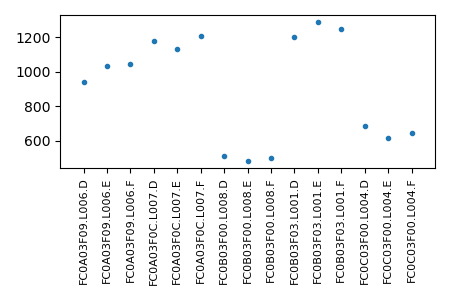

and the ``pairNumber.png`` for the large ``project`` should look like this:

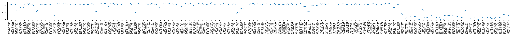

The large figure is probably not ideal and its layout can be improved. But the
birds eye view is informative and its resolution is high enough that one can
zoom in enough to see the details.

Step 2. Alignment and target coverage by sample
===============================================

The most frequent way to use sequence data involves aligning the sequencing
reads to a reference genome and the alignment is often the most computationally
hard task.  Conceptually, alignment is simple. Each read generated by a
sequencing machine comes from a random place in the genome of the studied
sample. The alignment is the process of finding the location in the reference
genome that each read originated from. This can be accomplished if for every
read we scored every possible location in the reference genome for how well it
matches the given read and if we selected the location that resembled the read
best. But genomes tend to be large (i.e., the human genome contains ~3 billion
positions) and the number of reads we need to align is also large (i.e., we may
have tens or even hundreds of millions of reads for each of tens, hundreds, or
thousands of samples we work with). The naive strategy thus fails miserably.
Fortunately, there are tools that use powerful indexing approaches and
heuristics to find excellent approximations to the optimal alignment and do
that fast.  We will use the popular `bwa <http://bio-bwa.sourceforge.net/>`_
tool here.

The next step after alignment is usually finding variants in the samples we
study. This involves examining all the reads that overlap every location of
interest to identify the nucleotides/alleles at the location, a process known as
genotyping. Since the sequencing is noisy and often we study diploid organisms
that can have two different alleles in a location, we need to observe many
reads for every position in a sample to genotype a position with confidence.
If we don't have enough reads at a position, we are not able to determine the
genotypes.  An important quality characteristic of the sequence dataset is the
distribution of the number of reads covering positions of interest across
samples. We refer to this distribution as 'coverage' distribution below.

Step 2.1. Reference genome indexing
-----------------------------------

bwa's approach to alignment is to create an index for the reference genome.
This index is then used to speed up the alignment of the fastq files. We will
create an object in our pipeline that will be responsible for the reference
genome and for its index:

.. literalinclude:: snakeobjectsTutorial/solutions/step-2.1/pipeline/build_object_graph.py
    :emphasize-lines: 8

The new objects type is ``reference`` and its objects id is ``o`` as we
typically name singleton objects. We set one parameter named
``symlink.chrAll.fa`` with a value taken from the project's parameter
``chrAllFile``. We will add the ``chrAllFile`` parameter to our two projects
and set it to point to the ``.../input/chrAll.fa`` file.  We can do that by
adding the line ``chrAllFile: "[C:inputDir]/chrAll.fa"`` to the
``so_project.yaml`` files of the two projects. (We will assume that you have
indeed done that!)

The parameter, ``symlink.chrAll.fa`` of our new ``reference/o`` object is a
special parameter due to its ``symlink.`` prefix. Such parameters enable us to
create targets for objects during the ``sobjects prepare`` phase. When an
object has a parameter with name like ``symlink.L`` and value ``P``, ``sobjects
prepare`` will create a symbolic link in the object's directory called ``L``
pointing to the path ``P``. Specifically, our reference object will have a
``chrAll.fa`` link (we can think of it as a target) pointing to the
``..../input/chrAll.fa``.  The following commands demonstrate that:

.. code-block:: bash

    (snakeobjectsTutorial) /tmp/snakeobjectsTutorial/projectTest$ sobjects prepare
    # WORKING ON PROJECT /tmp/snakeobjectsTutorial/projectTest
    # WITH PIPELINE /tmp/snakeobjectsTutorial/pipeline
    (snakeobjectsTutorial) /tmp/snakeobjectsTutorial/projectTest$ ls -l objects/reference/o
    total 4
    lrwxrwxrwx 1 yamrom   iossifovlab   56 Feb  8 12:04 chrAll.fa -> /tmp/snakeobjectsTutorial/projectTest/../input/chrAll.fa
    drwxr-xr-x 2 yamrom   iossifovlab 4096 Feb 27 12:02 log

We will add one target to the ``reference`` object type by copying the
following in the ``pipeline/reference.snakefile`` file:

.. literalinclude:: snakeobjectsTutorial/solutions/step-2.1/pipeline/reference.snakefile

This small rule uses many ``snakeobjects``/``snakemake`` features for the first
time in the tutorial. **First**, the input clause refers to the
``T("chrAll.fa")`` target built at the prepare phase through the ``symlink.``
parameter we discussed just above. **Second**, the output for the rule is a
'flag' target/file that is created with the ``touch`` function. This construct
is very convenient when the rule produces multiple files or has multiple steps
and we want to indicate that all the rule is supposed to do is done.
``snakemake``'s ``touch`` function creates (or updates the time-stamp of) such
files upon successful execution of its ``shell`` (or ``run``, or ``script``)
clause. In our case, we use the ``bwa index`` command that generates several
files next to the reference genome fasta (.fa) file.

**Third**, the ``makeBwaIndex`` rule uses a ``conda`` clause, indicating that
the rule should be executed with a different conda environment than the one we
run ``sobjects`` in. The ``conda`` clause's argument (``env-bwa.yaml``) points
to a file that describes the new environment to be created for this rule.  We
usually place such files in pipeline directory and in this case we add the
following content to the ``.../pipeline/env-bwa.yaml`` file:

.. literalinclude:: snakeobjectsTutorial/solutions/step-2.1/pipeline/env-bwa.yaml

The ``bwakit`` is the conda package that contains the ``bwa`` tool and the
``samtools`` is a tool that is used to manipulate the bam files that store the
alignment results generated by ``bwa``.  We will re-use the same environment in
different rules that directly use ``samtools`` shortly.  In this case we could
have easily added bwa and samtools to our global environment
(``snakeobjectsTutorial/environment.yml`` file), but it often happens that we
cannot build one environment that has all the tools necessary for all rules in
a pipeline because the rules may have contradictory requirements. For example,
two rules may require two different versions of the same tool, or rules may use
tools that depend on different version of the python. Such conflicts are
easily handled by allowing different environments for different rules.
Unfortunately, the ``conda`` clauses are not used by default and we need to
explicitly provide a ``--use-conda`` parameter to ``snakemake``. We will show
how to do that through ``sobjects run`` shortly.

**Forth**, we added the ``resources`` clause. This clause enables us to let
``snakemake`` know what the resource needs are to execute the given rule.
Indexing of the small reference genome provided with the tutorial does not need
large amounts of memory but indexing the complete human genome with ``bwa``
uses 10Gb. Declaring the required resources for each rule that uses a lot is
particularly important when we run ``sobjects`` or ``snakemake`` on a
computational cluster, where job scheduling and monitoring are guided by such
requirements.

**Fifth**, the rule uses ``snakemake``'s ``log`` clause together with
``snakeobjects``' convenience function :py:func:`.LFS` to configure log files
where we can store information about the execution of the rule. The
:py:func:`.LFS` function configures three log files associated with the object
the rule operates on and stored into the object's log directory.  The three log
files are: ``log.O`` typically used for standard output, ``log.E`` used for
standard error, and ``log.T`` used for timing measures. The names for these log
files are ``<log name>-out.txt``, ``<log name>-err.txt`` , and
``<log name>-time.txt``, respectively, where the ``<log name>`` is the
parameter given to the :py:func:`.LFS` function.  For example, the ``log.O``
from our ``makeBwaIndex`` rule for the ``projectTest`` project is:
``/mnt/snakeobjectsTutorial/projectTest/objects/reference/o/log/bwa_index-out.txt``

To actually create the bwa index for our projects, we need to execute
:option:`sobjects run`.  But to convince ``snakemake`` to notice the ``conda``
clauses, we have to provide the ``--use-conda`` command line argument:
``(snakeobjectsTutorial) /tmp/snakeobjectsTutorial/projectTest$ sobjects run -j
--use-conda``. Moreover, we have to provide this option every time we do
:option:`sobjects run` in the future when we extend the pipeline or when we
process new data. ``snakeobjects`` provides a better solution. We can define a
project parameter called ``default_snakemake_args`` whose value is a set of
command line parameters passed to ``snakemake`` automatically every time we do
:option:`sobjects run`. To take advantage of that we will add the line
``default_snakemake_args: "--use-conda"`` to ``so_project.yaml`` files for both
of our projects. For example, after we have added the
``default_snakemake_args`` and the ``chrAllfile`` parameters, the
``so_project.yaml`` file for the ``projectTest`` should look like:

.. literalinclude:: snakeobjectsTutorial/solutions/step-2.1/projectTest/so_project.yaml
    :emphasize-lines: 2,7

Now let's run the :option:`sobjects run` and examine the results:

.. code-block:: bash
    :emphasize-lines: 8, 10

    (snakeobjectsTutorial) /tmp/snakeobjectsTutorial/projectTest$ sobjects run -j
    # WORKING ON PROJECT /tmp/snakeobjectsTutorial/projectTest
    # WITH PIPELINE /tmp/snakeobjectsTutorial/pipeline
    UPDATING ENVIRONMENT:
    export SO_PROJECT=/tmp/snakeobjectsTutorial/projectTest
    export SO_PIPELINE=/tmp/snakeobjectsTutorial/pipeline
    export PATH=$SO_PIPELINE:$PATH
    RUNNING: snakemake -s /tmp/snakeobjectsTutorial/projectTest/objects/.snakeobjects/main.snakefile -d /tmp/snakeobjectsTutorial/projectTest/objects --use-conda -j
    Building DAG of jobs...
    Creating conda environment /tmp/snakeobjectsTutorial/pipeline/env-bwa.yaml...
    Downloading and installing remote packages.
    Environment for ../../pipeline/env-bwa.yaml created (location: .snakemake/conda/b244435f)
    Using shell: /bin/bash
    Provided cores: 192
    Rules claiming more threads will be scaled down.
    Job counts:
        count	jobs
        1	makeBwaIndex
        1	so_all_targets
        1	so_reference_obj
        3
    Select jobs to execute...
    ...

    (snakeobjectsTutorial) /tmp/snakeobjectsTutorial/projectTest$ ls -l objects/reference/o/*
    -rw-r--r-- 1 yamrom iossifovlab       0 Feb 27 17:13 objects/reference/o/chrAll.bwaIndex.flag
    lrwxrwxrwx 1 yamrom iossifovlab      56 Feb  8 12:04 objects/reference/o/chrAll.fa -> /tmp/snakeobjectsTutorial/projectTest/../input/chrAll.fa
    -rw-r--r-- 1 yamrom iossifovlab      67 Feb 27 17:13 objects/reference/o/chrAll.fa.amb
    -rw-r--r-- 1 yamrom iossifovlab     138 Feb 27 17:13 objects/reference/o/chrAll.fa.ann
    -rw-r--r-- 1 yamrom iossifovlab 1000116 Feb 27 17:13 objects/reference/o/chrAll.fa.bwt
    -rw-r--r-- 1 yamrom iossifovlab  250007 Feb 27 17:13 objects/reference/o/chrAll.fa.pac
    -rw-r--r-- 1 yamrom iossifovlab  500064 Feb 27 17:13 objects/reference/o/chrAll.fa.sa
    -rw-r--r-- 1 yamrom iossifovlab       0 Feb 27 17:13 objects/reference/o/obj.flag

    objects/reference/o/log:
    total 8
    -rw-r--r-- 1 yamrom iossifovlab 494 Feb 27 17:13 bwa_index-err.txt
    -rw-r--r-- 1 yamrom iossifovlab   0 Feb 27 17:12 bwa_index-out.txt
    -rw-r--r-- 1 yamrom iossifovlab  42 Feb 27 17:13 bwa_index-time.txt
    (snakeobjectsTutorial) /tmp/snakeobjectsTutorial/projectTest$ cat objects/reference/o/log/bwa_index-time.txt

    real	0m0.633s
    user	0m0.508s
    sys	0m0.021s

The first highlighted line shows that the ``--use-conda`` parameter was indeed
passed to ``snakemake`` even though we did not explicitly provide it on the
command line. The second highlighted line shows the message from ``snakemake``
that it is building a conda environment based on the ``env-bwa.yaml`` file.
Finally, the list of the ``objects/reference/o`` directory shows that the
``chrAll.bwaIndex.flag`` was created together with the five files
(``chrAll.fa.amb``, ``chrAll.fa.ann``, ``chrAll.fa.bwt``, ``chrAll.fa.pac``,
and ``chrAll.fa.sa``), that contain the bwa index. The list also shows
the three log files that were created and the last command shows the content of
the ``bwa_index-time.txt`` one that tells us that took 0.633s to create this
index.

Step 2.2. Alignment of fastq
----------------------------

With the bwa reference genome index created, it is time to align the reads in
our fastq runs. We will store the alignments as a target of the fastq objects
that have already been added to the object graph, but since the alignment uses
the reference genome index will make the fastq objects to be dependent on the
``reference/o`` object. This is easily accomplished by a small change (adding
the highlighted line) in the pipeline's ``build_objects_graph.py`` script:

.. literalinclude:: snakeobjectsTutorial/solutions/step-2.2/pipeline/build_object_graph.py
    :emphasize-lines: 18

We will add the new target (``fastq.bam``) and the rule that creates it to the
end of our ``pipeline/fastq.snakefile`` file:

.. literalinclude:: snakeobjectsTutorial/solutions/step-2.2/pipeline/fastq.snakefile
    :emphasize-lines: 22-43

The new target, ``fastq.bam``, is a ``bam`` file. ``bam`` is a well-accepted
binary file standard format for storing the results of alignments. ``sam``
files are the text version of the ``bam`` files. The ``bwa`` tool we use for
alignment generates sam format that is easily converted into the more efficient
bam format using ``samtools``.  That is the reason we required samtools to be
part of the ``env-bwa.yaml`` conda environment which we here re-use in our new
``align`` rule.  In the new rule, we avoid storing the large sam files by
piping (``|``) the sam output of ``bwa`` through ``samtools`` and storing only
the significantly smaller ``bam`` files.

The ``align`` rule demonstrates a couple of important
``snakeobjects``/``snakemake`` features.  For the first time in this rule we
use named inputs. The rule has four inputs, and we have called them
``refFile``, ``refFileBwaIndex``, ``R1File``, and ``R2File``. Named inputs can
be used in the implementation of the rule using constructs like
``{input.refFile}``. This clearly improves the readability compared to
``{input[0]}`` particularly in rules with many inputs of different types.  It's
worthwhile pointing out that the ``refFileBwaIndex`` is listed as an input
but is not explicitly used in the implementation. ``snakemake`` will execute
this rule only after all its inputs have been created which is important here
because ``bwa`` implicitly requires the index files that must have been
prepared before the ``chrAll.bwaIndex.flag`` is created. The ``refFile`` and
``refFileBwaIndex`` are set to point to the ``chrAll.fa`` and
``chrAll.bwaIndex.flag`` targets of the dependency ``reference/o`` object, while
``R1File`` and ``R2File`` are taken for the current object's parameters ``R1``
and ``R2``.

Also, for the first time, the ``align`` rule shows ``snakemake``'s
``params`` and ``threads`` clauses. The ``params`` clause allows each execution
of the rule to be tuned by use of rule specific parameters. With
``snakeobjects`` we often set the rule's parameters with values taken from
parameters of the object the rule operates on (i.e., :py:func:`.P`) or from
global project parameters (:py:func:`.PP`). The parameters of the rule can then
be used in the implementation of the rule using constructs like
``{params.sId}``. The ``threads`` clause is the way to inform ``snakemake`` of
the number of threads the rule will use in its implementation. Alignment of
sequencing reads with bwa is a task that can benefit greatly from the use of
threads. The tool typically loads into memory a fairly large index and then
uses that index to align tens or even hundreds of millions of reads or read
pairs. Each read is aligned independently. Having many threads share the same
index but process different reads goes a long way towards optimizing memory
usage, a resource that is frequently a bottleneck in large sequence analysis
projects. But when we execute on computational cluster we have to take into
account the number of cores configured on the individual cluster nodes and how
easy it is to schedule a job requiring many threads in typical cluster loads or
when we run large projects. The ability to control the number of threads,
memory, and other resources separately for each rule makes is possible to
develop a strategy for balancing the many conflicting requirements.

We will now create the alignment bam files first for the ``projectsTest`` project
and then for the large ``project``. We need to recreate the object graph (by running
:option:`sobjects prepare`) because we introduced the new dependence of fastq objects
on the ``reference/o``. But unless we start from scratch, by removing the ``objects``
directory, we would need to help ``snakemake`` a bit by asking explicitly to run the
``align`` rule---here we are again in the situation when we add a target to an already
complete object.

.. code-block:: bash

    (snakeobjectsTutorial) /tmp/snakeobjectsTutorial/projectTest$ sobjects prepare
    (snakeobjectsTutorial) /tmp/snakeobjectsTutorial/projectTest$ sobjects run -j -R align
    # WORKING ON PROJECT /tmp/snakeobjectsTutorial/projectTest
    # WITH PIPELINE /tmp/snakeobjectsTutorial/pipeline
    UPDATING ENVIRONMENT:
    export SO_PROJECT=/tmp/snakeobjectsTutorial/projectTest
    export SO_PIPELINE=/tmp/snakeobjectsTutorial/pipeline
    export PATH=$SO_PIPELINE:$PATH
    RUNNING: snakemake -s /tmp/snakeobjectsTutorial/projectTest/objects/.snakeobjects/main.snakefile -d /tmp/snakeobjectsTutorial/projectTest/objects --use-conda -j -R align
    Building DAG of jobs...
    Using shell: /bin/bash
    Provided cores: 192
    Rules claiming more threads will be scaled down.
    Job counts:
        count	jobs
        15	align
        1	so_all_targets
        1	so_fastqSummary_obj
        15	so_fastq_obj
        32
    Select jobs to execute...
    ...

On the small ``projectTest`` this finishes quickly, well under a minute. But
when you repeat the same commands for the large project (we expect that you
will indeed to that) it may take several minutes to create all 384 alignment
files. And in real sequence alignment projects it is impractical to run many
alignments on a single computer. One of the most important features of
``snakeobjects``, directly inherited from ``snakemake``, is that the same
pipeline without any change can be executed on a computational cluster by
simply providing the command line parameter ``--profile=<cluster profile>`` to
the :option:`sobjects run`.  The ``<cluster profile>`` points to a directory
that contains the setup necessary to submit jobs on a given cluster. The
configuration of the cluster profiles is beyond the scope of this tutorial
publicly available profiles and descriptions can be found
`here <https://github.com/snakemake-profiles/doc>`_).
If you happen to have one available or, if go through the steps described
in :ref:`working-with-clusters`, you should by all means execute the
tutorial pipelines on your cluster. Note though that the jobs generated
by running the tutorial projects are all small because we prepared a toy input
datasets.  For small jobs like these the overhead of submitting and scheduling
may be unnecessarily large. When you get a cluster profile
configured, you may also consider adding the ``--profile=<cluster profile>`` to
the ``default_snakemake_args`` project parameter. Every time that you use
:option:`sobjects run` for that project the ``snakemake`` will submit jobs to the
cluster instead of running them locally on your computer as it does when you
pass the ``-j`` option.

Step 2.3. Target coverage by sample and globally
------------------------------------------------

In this step we will introduce two new object types, ``sample`` and
``sampleSummary``. The ``sample`` object type will be the most complicated
object type in this tutorial but will introduce only few of the
``snakeobjects``' features. The point of this step is to demonstrate how the
functionality introduced so far is powerful enough to implement a fairly
complex part of the pipeline.

A ``sample`` object will represent all sequence data for one individual. We did
not pay much attention until now, but ``sampleId`` parameter of the ``fastq``
objects specifies the sample (or individual) whose genome is represented in the
sequence reads in the fastq files. If you examine the ``input/fastqs.txt``
file, you will see that some individuals have one fastq run, but others have
two or three fastq runs.

It is important to verify if we have enough sequencing reads for each sample.
One way to check if the number of reads is 'enough' is to examine the
distribution of the number of reads covering the positions of interest (or
coverage). In our project, the positions of interest are represented by the
``targetRegions.txt`` file in the input directory.  To measure the coverage
(and to be able to identify *de novo* variants later) it is convenient to merge
all the fastq bam files for an individual into a single sample bam file. Then,
we can use the single file to examine the depth (number of covering reads) for
all the positions in the target regions. Once we have the coverage for every
position in the target and for every sample, we can compute statistics of the
depth per sample, and visualize the coverage distribution per sample and
globally across all samples.

To implement this plan, we will add a project parameter called ``target`` that
points to the ``input/targetRegions.bed`` file to the ``so_project.yaml`` for
our two projects.  For example, the ``projectTest/so_project.yaml`` should look
like that after the addition of the highlighted line:

.. literalinclude:: snakeobjectsTutorial/solutions/step-2.3/projectTest/so_project.yaml
    :emphasize-lines: 8

We will then update the ``build_object_graph.py`` script in our pipeline by
adding a few lines (highlighted below) that create the sample objects referenced
by the fastq objects already added to the object graph:

.. literalinclude:: snakeobjectsTutorial/solutions/step-2.3/pipeline/build_object_graph.py
    :emphasize-lines: 3, 23-29

The code above is simple enough (assuming one knows basic python). But the
resulting graph becomes non-trivial. Before the addition of the ``sample``
object, there were two dependency types: (1) all ``fastq`` objects depended on
the single ``reference/o`` object and (2) the single ``fastqSummary/o`` object
depended on all ``fastq`` objects. Each ``sample`` object is dependent only on
the one, two, or three fastq objects that are related to this sample, breaking
the one-to-all dependence types.  At the last line we also add the singleton
``sampleSummary/o`` object that will be responsible for aggregating statistics
from all ``sample`` objects.

We will add six targets for the objects of type ``sample``. The target
definition, their relationships, and rules that create them are shown below and
you should copy the following content to a file called ``sample.snakefile``
within the pipeline directory.

.. literalinclude:: snakeobjectsTutorial/solutions/step-2.3/pipeline/sample.snakefile

The six targets are related in a complex within-object and across-object target
dependencies represented by the input and output clauses of the rules. In
addition, to the six targets the ``sample.snakefile`` uses a temporary target
``T("raw.bam")``. It is declared as temporary using ``snakemake``'s
function ``temp``. Temporary targets are created as normal targets but are
removed when all the downstream rules that use them finish successfully. The
:py:func:`.DT` function, enables us to concisely define across-objects target
dependencies. The figure below, shows a graphical representation of the target
dependency relationship of the targets of one of the ``sample`` objects
overlaid on top of the object-graph dependency relationships.

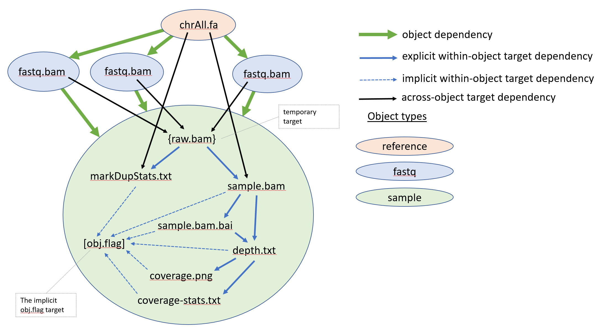

We want to point out two interesting features used in the ``sample.snakefile``.
The first one is the ``level=2`` parameter passed on the :py:func:`.DT`
function call in the rule ``normalizedBam``.  It means that we are referring to
targets in objects that are two steps away in the object graph. In the specific
case, the implementation of the rule requires the ``chrAll.fa`` file that is
stored as a target of the ``reference/o`` object. The ``sample`` objects do not
depend directly on the ``reference/o`` object in our graph, but they depend on
one or more ``fastq`` objects which in turn depend on the ``reference/o``.
Thus, ``reference/o`` is 'two steps' away in the object graph from the
``sample`` objects.  The second feature is that a rule can create more than one
output targets, as our ``reorganizedBam`` rule does.

For each ``sample``, we first merge the related ``fastq.bam`` files in one bam
file called ``raw.bam`` using the ``samtools merge`` command. Then we go
through a process of 'cleaning up` the ``raw.bam`` file by a series of commands
well accepted in the sequence analysis field (fixmate, sort, markdup). The
implementation of the ``reorganizedBam`` rule uses piping extensively, an
approach that saves the expensive writes/reads to disk if we saved the
intermediate files. The ``markdup`` step identifies read pairs that appear to
be duplicates of each other, flags the duplicates, and saves the updated bam
file. In addition, ``markdup`` writes statistics, like the number of duplicate
reads identified, on its standard error. The ``reorganizedBam`` rule captures
this stream and saves it in the ``markDupStats.txt`` target. The percent of
duplicated reads in bam file is an important quality measure that one should
pay attention to. To avoid getting this tutorial even longer, we do not discuss
the ``markDupStats.txt`` further. The main output of the ``reorganziedBam``
rule is the cleaned, flagged, and sorted (by genomic coordinates)
``sample.bam`` file. We next create an index ``sample.bam.bai`` for the
``sample.bam`` file that allows quick access to the reads aligned at a given
genomic region. This index is used to measure the depth for every position in
our target regions in the ``depth`` rule that saves the resulting depths in the
``depths.txt`` target file. Finally, for each sample, we use the ``depths.txt``
(1) to create a figure (``coverage.png``) showing the distribution of the
depths and (2) to record the percent of the target positions covered by at
least 1, 10, 20, and 40 reads in the ``coverage-stats.txt`` target. The
``coverage.png`` and the ``coverage-stats.txt`` are created by two separate
rules, both of which use ``depths.txt`` and are implemented by small python
snipped using a ``run:`` clause.

To finish the updates to the pipeline you should copy the content bellow to
the ``sampleSummary.snakefile`` in our pipeline:

.. literalinclude:: snakeobjectsTutorial/solutions/step-2.3/pipeline/sampleSummary.snakefile

``sampleSummary`` objects has two targets. The first one is called
``allCoveratStats.txt`` and its implementation aggregates the
``coverage-stats.txt`` from all the ``sample`` objects and sorts by the
percent of the target covered by at least 20 reads (the 4th column in the
``coverage-stats.txt`` files). The second target, called ``allCoverages.png``,
is a figure showing the coverage statistics across all samples.

By now, it should be clear how execute the updated pipeline for the two
projects: change the working directory to the project directory; do ``sobjects
prepare`` (we need to run prepare because we updated the
``build_object_graph.py`` script and we need to create a new object graph); do
``sobjects run -j``.

Once you have successfully run the two projects you should have a figure like

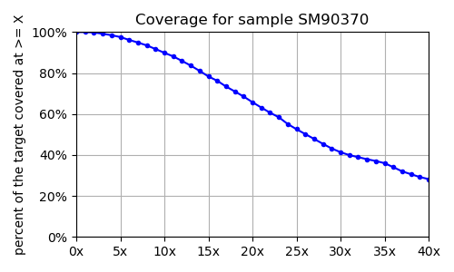

for each sample. The ``objects/sampleSummary/o/allCoverages.png`` for the ``projectTest`` and
for the large ``project`` should look like:

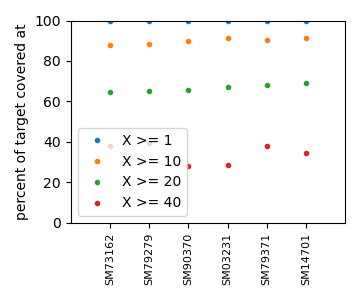

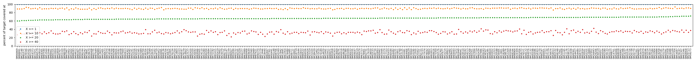

Step 3. Calling *de novo* variants
==================================

To finish the tutorial, we will implement a quick and dirty *de novo* caller
and will integrate it into our pipeline. Our *de novo* caller will look for
*de novo* nucleotides found in children that are not present in their parents.
Its implementation is shown below:

.. literalinclude:: snakeobjectsTutorial/solutions/final/pipeline/call_denovo.py
    :linenos:

It is implemented in python and you should copy the above in a file called
``call_denovo.py`` in our pipeline directory and make sure that it is flagged as
executable (``chmod +x call_denovo.py``. The only quality this
implementation has is that it is short. Otherwise, it is a poorly coded
(although not impossible, it will be a challenge for one to understand it), and
performs poorly. But it would do for the purposes of the tutorial. Those of
you who actually care about finding *de novo* variants should improve this
implementation substantially or, even better, replace it all together with a
'proper' de novo caller.

The ``call_denovo.py`` is a command line scripts that expects four arguments:
the bam files for the father, for the mother, for a child and a list of target
regions that contain the positions in which the script will search for *de
novo* alleles. The script uses the popular python module ``pysam`` that
provides access to reads stored in bam files. The pysam is neither included in
our global environment nor in the ``env-bwa.yaml`` one.  We thus crate a new
environment ``env-pysam.yaml`` that requires the pysam package.  You should
copy the following in the ``env-pysam.yaml`` file in our pipeline directory---
we will use it shortly. The ``env-pysam.yaml`` environment requires two
additional packages, numpy and pandas, used by the ``call_denovo.py`` script.

.. literalinclude:: snakeobjectsTutorial/solutions/final/pipeline/env-pysam.yaml

The ``call_denovo.py`` script iterates over all the regions in the
``targetFile`` and counts the number of reads supporting each of the four
nucleotides, A, C, G, and T at every position within the current region. For
positions that are covered by reads in the three bam files (see the mysterious
line 25), the script checks if there are *de novo* alleles. A *de novo* allele
is reported if all of the following criteria are met:

    * the allele is seen in 3 or more reads in the child (line 29);
    * the allele is NOT seen in either of the parents (lines 30 and 31);
    * both parents have at least 10 reads covering the positions (line 32).

To integrate the ``call_denovo.py`` script in the pipeline, we will create two
new objects types, ``trio`` and ``trioSummary``. The ``trio`` object will
represent a father, a mother, and a child trio. In our project the family
relationships are described in the ``input/collection.ped`` file. The top 10
lines of the file are shown below:

.. include:: snakeobjectsTutorial/input/collection.ped
    :start-line: 0
    :end-line: 10
    :literal:
    :tab-width: 10

The question marks in the affected column indicate that the affected status of
the children is 'masked'. This can be done in real projects to avoid bias in
the handling between the cases and controls.

We will use the ``collections.ped`` file in the ``build_object_graph.py``
pipeline script to create the ``trio`` objects. As already done multiple times,
we will add a project parameter (``pedigree``) in our two projects that points
to the ``collection.ped`` file. After the addition, the ``so_project.yaml``
file for the ``projectTest`` looks like:

.. literalinclude:: snakeobjectsTutorial/solutions/final/projectTest/so_project.yaml
    :emphasize-lines: 9

The additions the ``build_object_graph.py`` are highlighted bellow:

.. literalinclude:: snakeobjectsTutorial/solutions/final/pipeline/build_object_graph.py
    :linenos:
    :emphasize-lines: 31-40

The script will create ``trio`` objects only for the children described in the
``pedigree`` file (line 33) and only for the children for which the ``sample``
objects for the father, for the mother, and for the child have already been
created in the object graph (line 34).  The object id for the ``trio`` objects
will be set to the sampleId (called ``personId`` in the pedigree file) of the
child and the newly created ``trio`` are made dependent on the samples for the
father, mother, and child.  A very important feature of ``snakeobjects`` is
that the order of the dependencies is preserved in the object graph. The
implementation for the single target of the ``trio`` objects depends on this
order: father's sample, mother's sample, child's sample. See the content bellow
and copy it into the new ``trio.snakefile`` file in the pipeline directory:

.. literalinclude:: snakeobjectsTutorial/solutions/final/pipeline/trio.snakefile
    :emphasize-lines: 5

In the highlighted line, the ``DT("sample.bam")`` will return a list of 3 bam
files, with the first one being the ``sample.bam`` file for the father, the
second one being the ``sample.bam`` file for the mother, and the third one
being the ``sample.bam`` file for the child, honoring the order in which the
object dependencies were listed in the creation of the ``trio`` object.

Apart from the important issue about the dependency order, the ``callDenovos``
rule demonstrates the use the function :py:func:`.PP` to access a project
parameter in the configuration of the rule's parameters.

Finally, the ``trioSummary.snakefile`` is also fairly simple, and contains one
target, ``allDenovoCalls.txt``, that is the union of the *de novo* variants
found in the individual trios:

.. literalinclude:: snakeobjectsTutorial/solutions/final/pipeline/trioSummary.snakefile

One useful trick in the ``trioSummary.snakefile`` is the way we use the shell
commands ``head``, ``for``, and ``tail``, to combine several files that have
identical header, without repeating the header multiple times.

We can now re-run the ``project``, and ``projectTest`` with :option:`sobjects
prepare` and :option:`sobjects run`. Below, we show the
``.../projectTest/objects/trioSummary/o/allDenovoCalls.txt`` after the
execution of the ``projectTest`` is done (and with a bit of manual formatting
in Excel):

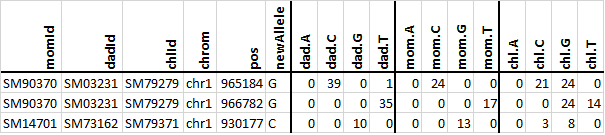

Two *de novo* variants are identified in the ``SM79279`` child and one is
identified in the ``SM79371`` child. The first *de novo* is an ``G`` allele at
position ``chr1:965184`` that is: supported by 24 reads (which is larger than
3) in the child; not seen at all in his parents (dad.G and mom.G are both 0)
and both parents have more than 10 reads covering the ``chr1:965184`` position
(dad has 39 + 1 = 40 reads and mom has 24 reads).  All the criteria for a *de
novo* allele are thus met. All the criteria are also met for the other two
reported *de novo* variants. But, the third variant (the new ``C`` at
``chr1:930177``) just barely meets the cut-offs and it is possible that it is a
false *de novo* call--the three ``C`` s in the child may all be due to noise, or
a ``C`` in one of the parents may have failed to get sampled in the few reads
from that location.

When you successfully execute the large ``project``, you should get a list of 47
de novo variants.

Summary
=======

Congratulations to all of you who are reading this sentence!
This was an objectively very long tutorial.
For a bit of fun at the end, we will use the :option:`sobjects graph` command to
create a visual summary of the many steps for both of small ``projectTest`` and
the large ``projects``.

.. code-block:: bash

    (snakeobjectsTutorial) .................$ cd /tmp/snakeobjectsTutorial/solutions
    (snakeobjectsTutorial) /tmp/snakeobjectsTutorial/solutions$ for s in step-1.8 step-1.9 step-2.1 step-2.2 step-2.3 final; do
        (cd $s/projectTest; sobjects prepare;
         sobjects graph -i 1 -s box -l lgnd.dot | dot -Tpng > g.png;
         cat lgnd.dot | dot -Tpng > lgnd.png);
    done
    (snakeobjectsTutorial) /tmp/snakeobjectsTutorial/solutions$ for s in step-1.8 step-1.9 step-2.1 step-2.2 step-2.3 final; do
        (cd $s/project; sobjects prepare;
         sobjects graph -w 0.1 -p 0.2 -a 0.2 | neato -Tpng > g.png);
    done

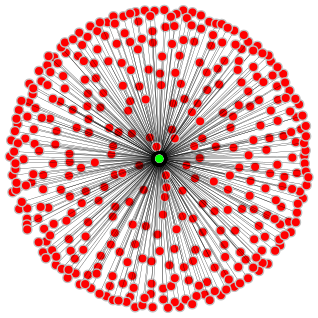
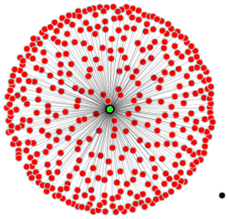
.. |P22| image:: _static/project-step-2.2-graph.png
    :width: 300
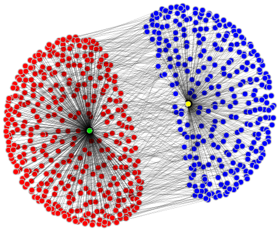
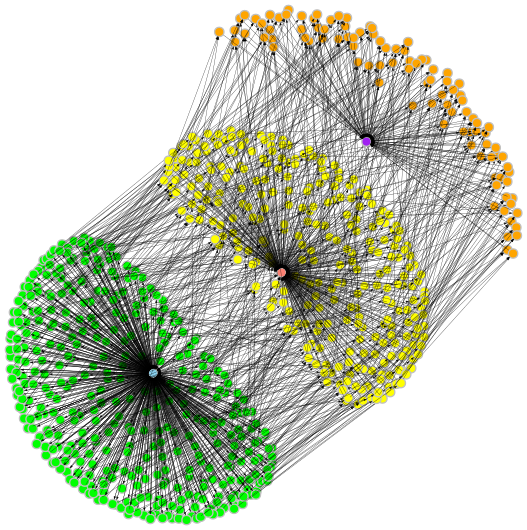

.. |T21| image:: _static/projectTest-step-2.1-graph.png
    :width: 300
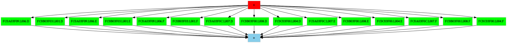
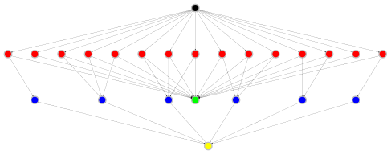
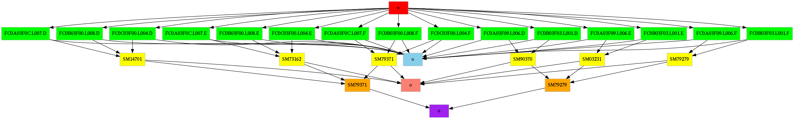

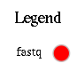
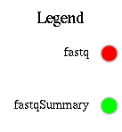
.. |L21| image:: _static/legend-step-2.1.png
    :width: 300
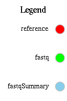
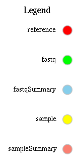
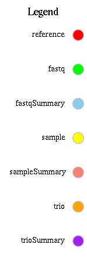

+----+---------------+-----------------+-----------+
|step| projectTest   | project         |object type+
+====+===============+=================+===========+
|1.8 | |T18|         + |P18|           +   |L18|   +
+----+---------------+-----------------+-----------+
|1.9 | |T19|         + |P19|           +   |L19|   +
+----+---------------+-----------------+-----------+
|2.1 | |T21|         + |P21|           +   |L21|   +
+----+---------------+-----------------+-----------+
|2.2 | |T22|         + |P22|           +   |L22|   +
+----+---------------+-----------------+-----------+
|2.3 | |T23|         + |P23|           +   |L23|   +
+----+---------------+-----------------+-----------+
|3.0 | |T30|         + |P30|           +   |L30|   +
+----+---------------+-----------------+-----------+

